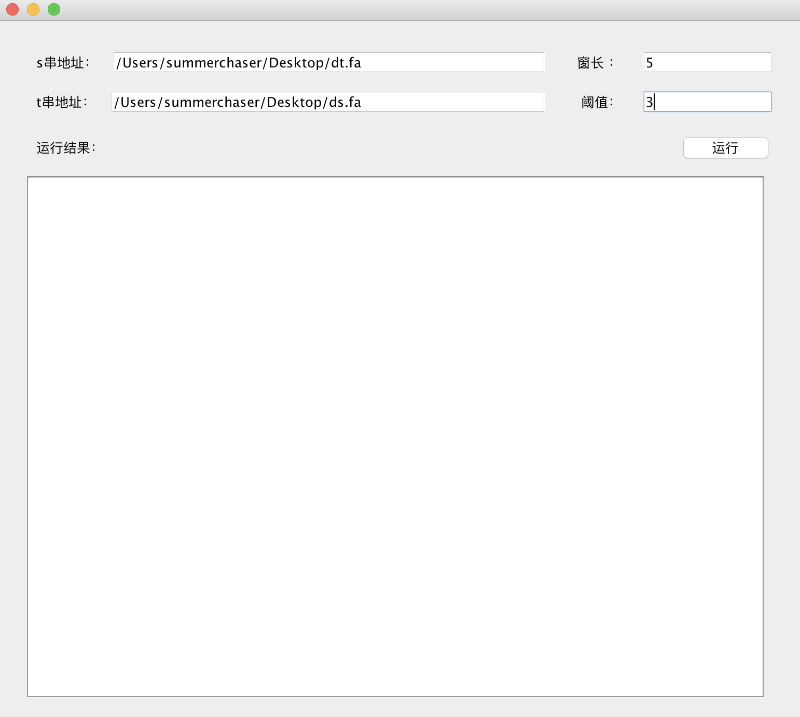
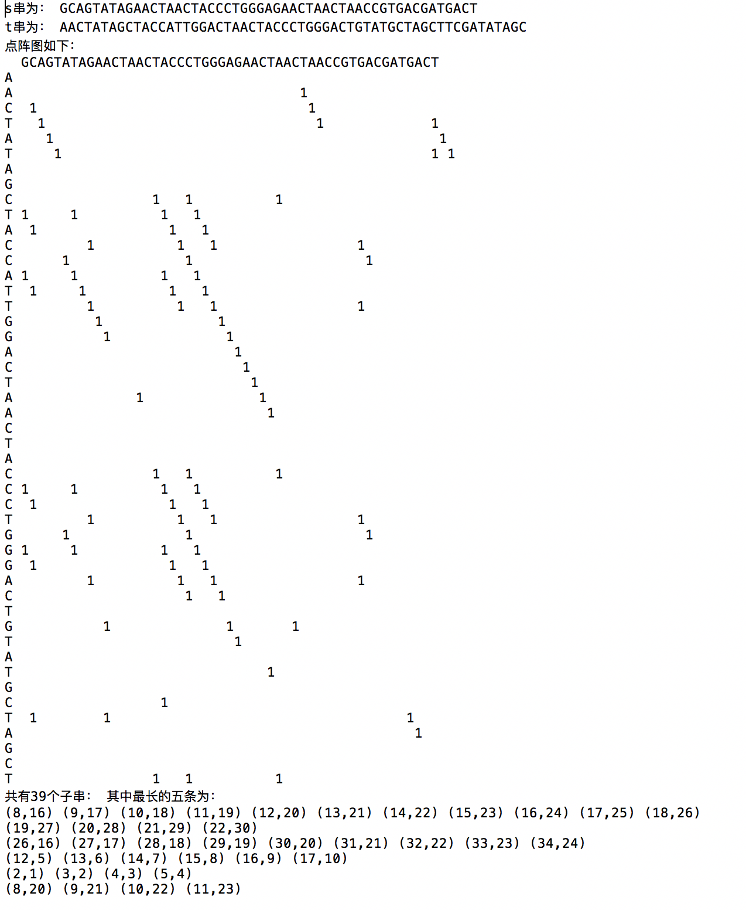

## DotMatrix

生物信息点阵图编程实现 

         生信DotMatrix 用JAVA写了个GUI 代码有待优化 另到时候打算做个网页版的

功能：
- [ ] 读入.fa文件
- [ ] 运用滑窗技术，可自定义窗长和阈值，生成对应序列点阵图
- [ ] 所有子串，并展示最长的五条坐标

原理介绍
---------
点阵图又称矩阵作图法，可以很直观发现两个序列的相似部分。

### 基本思想：
- 将两个待比较序列放在矩阵的x,y轴上   
- 当行与列上的字符匹配时候，在矩阵的对应位置做标记   

如果两个序列存在相同子串，则存在一条与主对角线平行的标记点构成的斜线与之对应  
若存在两条方向序列，则反对角线方向出现标记点斜线。  
  
点阵图上，相似区域表现为对角线，序列相对偏移表现为移置的对角线。  
  
最佳比对：找到矩阵标记图中非重叠平行线的最长组合  

### 滑动窗口技术
  
对于较长序列会出现很多匹配字符，在点阵图中形成很多标记，模糊而复杂。  
核心思想 : 用滑动窗口代替一次一个位点的比较。  
  
设定  
窗口大小为 w=10  
相似度阈值为 	T=8  
则每次比较取连续的10个字符，若相同字符数超过阈值8，则标记该窗口对应位置为匹配。  
  
优点：  
1. 明显降低点阵图噪声  
2. 明确指示出两序列具有显著相似性的区域  

 
效果图
--------------------------------

